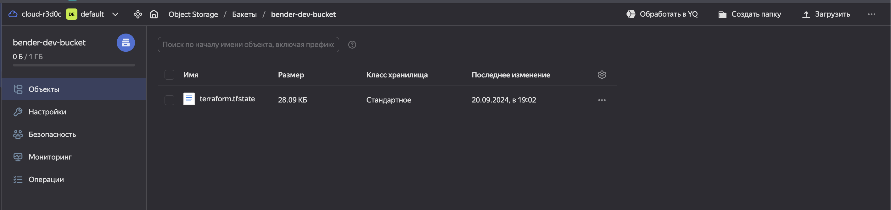
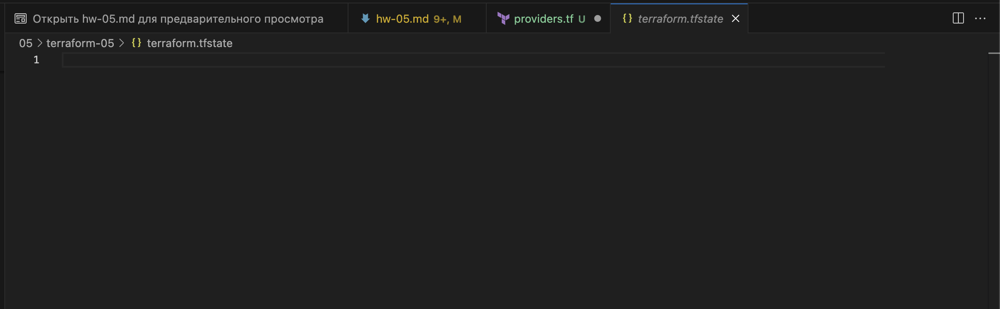
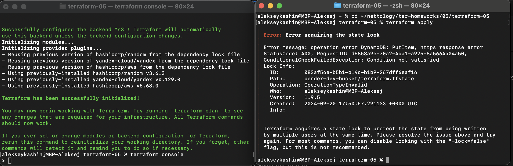
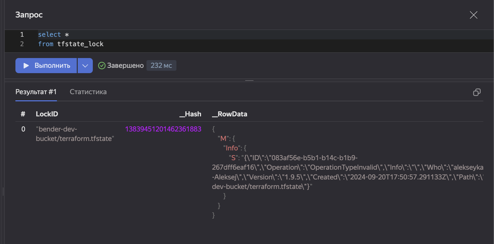
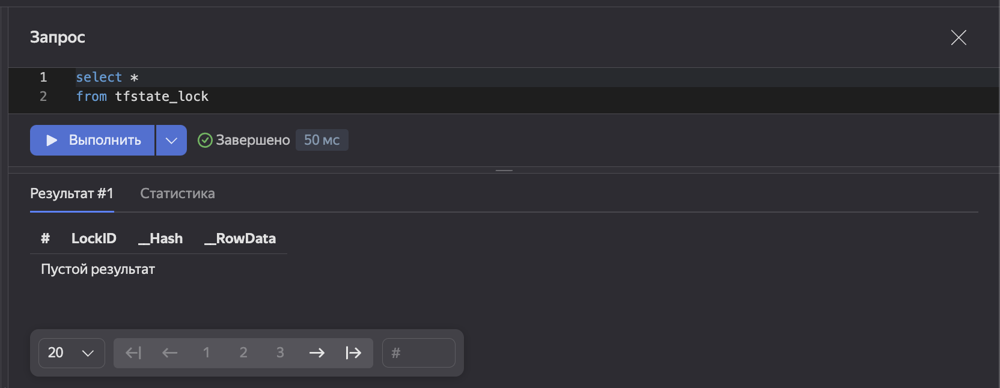

# Домашнее задание к занятию «Использование Terraform в команде»

### Цели задания

1. Научиться использовать remote state с блокировками.
2. Освоить приёмы командной работы.


### Чек-лист готовности к домашнему заданию

1. Зарегистрирован аккаунт в Yandex Cloud. Использован промокод на грант.
2. Установлен инструмент Yandex CLI.
3. Любые ВМ, использованные при выполнении задания, должны быть прерываемыми, для экономии средств.

------
### Внимание!! Обязательно предоставляем на проверку получившийся код в виде ссылки на ваш github-репозиторий!
Убедитесь что ваша версия **Terraform** ~>1.8.4
Пишем красивый код, хардкод значения не допустимы!

------
### Задание 0
1. Прочтите статью: https://neprivet.com/
2. Пожалуйста, распространите данную идею в своем коллективе.

------

### Задание 1

1. Возьмите код:
- из [ДЗ к лекции 4](https://github.com/netology-code/ter-homeworks/tree/main/04/src),
- из [демо к лекции 4](https://github.com/netology-code/ter-homeworks/tree/main/04/demonstration1).
2. Проверьте код с помощью tflint и checkov. Вам не нужно инициализировать этот проект.
3. Перечислите, какие **типы** ошибок обнаружены в проекте (без дублей).


#### Решение 

1. Устанавливаем локально ```tflint, checkov```

    ```bash
    alekseykashin@MBP-Aleksej ter-homeworks % tflint -v
    TFLint version 0.53.0
    + ruleset.terraform (0.9.1-bundled)
    alekseykashin@MBP-Aleksej ter-homeworks % checkov -v
    3.2.250
    alekseykashin@MBP-Aleksej ter-homeworks % 
    ```

2. Проверяем ```demonstration1``` линетром ```tflint```

    ```bash
    alekseykashin@MBP-Aleksej 04 % tflint --chdir=./demonstration1/ --recursive --color --call-module-type local --format compact --enable-plugin terraform
    6 issue(s) found:

    demonstration1/passwords/main.tf:8:1: Warning - Missing version constraint for provider "random" in `required_providers` (terraform_required_providers)
    demonstration1/vms/main.tf:23:20: Warning - Module source "git::https://github.com/udjin10/yandex_compute_instance.git?ref=main" uses a default branch as ref (main) (terraform_module_pinned_source)
    demonstration1/vms/main.tf:46:20: Warning - Module source "git::https://github.com/udjin10/yandex_compute_instance.git?ref=main" uses a default branch as ref (main) (terraform_module_pinned_source)
    demonstration1/vms/main.tf:64:1: Warning - Missing version constraint for provider "template" in `required_providers` (terraform_required_providers)
    demonstration1/vms/providers.tf:3:14: Warning - Missing version constraint for provider "yandex" in `required_providers` (terraform_required_providers)
    demonstration1/vms/variables.tf:3:1: Warning - variable "public_key" is declared but not used (terraform_unused_declarations)
    ```

3. Проверяем ```demonstration1``` через ```checkov``` (не получилось рекурсивно проверить)

    - Отдельно ```vms```

    ```bash
    alekseykashin@MBP-Aleksej 04 % checkov -d ./demonstration1/vms --compact --framework terraform --download-external-modules true      
    [ terraform framework ]: 100%|████████████████████|[10/10], Current File Scanned=demonstration1/vms/variables.tf                                    


        _               _              
    ___| |__   ___  ___| | _______   __
    / __| '_ \ / _ \/ __| |/ / _ \ \ / /
    | (__| | | |  __/ (__|   < (_) \ V / 
    \___|_| |_|\___|\___|_|\_\___/ \_/  
                                        
    By Prisma Cloud | version: 3.2.250 
    Update available 3.2.250 -> 3.2.255
    Run pip3 install -U checkov to update 


    terraform scan results:

    Passed checks: 3, Failed checks: 10, Skipped checks: 0

    Check: CKV_YC_4: "Ensure compute instance does not have serial console enabled."
        PASSED for resource: module.example-vm.yandex_compute_instance.vm[0]
        File: /.external_modules/github.com/udjin10/yandex_compute_instance/main/main.tf:24-73
        Calling File: /main.tf:45-61
    Check: CKV_YC_4: "Ensure compute instance does not have serial console enabled."
        PASSED for resource: module.test-vm.yandex_compute_instance.vm[0]
        File: /.external_modules/github.com/udjin10/yandex_compute_instance/main/main.tf:24-73
        Calling File: /main.tf:22-43
    Check: CKV_YC_4: "Ensure compute instance does not have serial console enabled."
        PASSED for resource: module.test-vm.yandex_compute_instance.vm[1]
        File: /.external_modules/github.com/udjin10/yandex_compute_instance/main/main.tf:24-73
        Calling File: /main.tf:22-43
    Check: CKV_YC_2: "Ensure compute instance does not have public IP."
        FAILED for resource: module.example-vm.yandex_compute_instance.vm[0]
        File: /.external_modules/github.com/udjin10/yandex_compute_instance/main/main.tf:24-73
        Calling File: /main.tf:45-61
    Check: CKV_YC_11: "Ensure security group is assigned to network interface."
        FAILED for resource: module.example-vm.yandex_compute_instance.vm[0]
        File: /.external_modules/github.com/udjin10/yandex_compute_instance/main/main.tf:24-73
        Calling File: /main.tf:45-61
    Check: CKV_YC_2: "Ensure compute instance does not have public IP."
        FAILED for resource: module.test-vm.yandex_compute_instance.vm[0]
        File: /.external_modules/github.com/udjin10/yandex_compute_instance/main/main.tf:24-73
        Calling File: /main.tf:22-43
    Check: CKV_YC_11: "Ensure security group is assigned to network interface."
        FAILED for resource: module.test-vm.yandex_compute_instance.vm[0]
        File: /.external_modules/github.com/udjin10/yandex_compute_instance/main/main.tf:24-73
        Calling File: /main.tf:22-43
    Check: CKV_YC_2: "Ensure compute instance does not have public IP."
        FAILED for resource: module.test-vm.yandex_compute_instance.vm[1]
        File: /.external_modules/github.com/udjin10/yandex_compute_instance/main/main.tf:24-73
        Calling File: /main.tf:22-43
    Check: CKV_YC_11: "Ensure security group is assigned to network interface."
        FAILED for resource: module.test-vm.yandex_compute_instance.vm[1]
        File: /.external_modules/github.com/udjin10/yandex_compute_instance/main/main.tf:24-73
        Calling File: /main.tf:22-43
    Check: CKV_TF_1: "Ensure Terraform module sources use a commit hash"
        FAILED for resource: test-vm
        File: /main.tf:22-43
        Guide: https://docs.prismacloud.io/en/enterprise-edition/policy-reference/supply-chain-policies/terraform-policies/ensure-terraform-module-sources-use-git-url-with-commit-hash-revision
    Check: CKV_TF_2: "Ensure Terraform module sources use a tag with a version number"
        FAILED for resource: test-vm
        File: /main.tf:22-43
        Guide: https://docs.prismacloud.io/en/enterprise-edition/policy-reference/supply-chain-policies/terraform-policies/ensure-terraform-module-sources-use-tag
    Check: CKV_TF_1: "Ensure Terraform module sources use a commit hash"
        FAILED for resource: example-vm
        File: /main.tf:45-61
        Guide: https://docs.prismacloud.io/en/enterprise-edition/policy-reference/supply-chain-policies/terraform-policies/ensure-terraform-module-sources-use-git-url-with-commit-hash-revision
    Check: CKV_TF_2: "Ensure Terraform module sources use a tag with a version number"
        FAILED for resource: example-vm
        File: /main.tf:45-61
        Guide: https://docs.prismacloud.io/en/enterprise-edition/policy-reference/supply-chain-policies/terraform-policies/ensure-terraform-module-sources-use-tag

    alekseykashin@MBP-Aleksej 04 % 
    ```

    - Отдельно ```passwords```

    ```bash
    alekseykashin@MBP-Aleksej 04 % checkov -d ./demonstration1/passwords --compact --framework terraform --download-external-modules true
    [ terraform framework ]: 100%|████████████████████|[3/3], Current File Scanned=demonstration1/passwords/remote_state_outputs.tf


        _               _              
    ___| |__   ___  ___| | _______   __
    / __| '_ \ / _ \/ __| |/ / _ \ \ / /
    | (__| | | |  __/ (__|   < (_) \ V / 
    \___|_| |_|\___|\___|_|\_\___/ \_/  
                                        
    By Prisma Cloud | version: 3.2.250 
    Update available 3.2.250 -> 3.2.255
    Run pip3 install -U checkov to update 


    alekseykashin@MBP-Aleksej 04 % 
    ```

4. Проверяем ```src``` линетром ```tflint```

    ```bash
    alekseykashin@MBP-Aleksej 04 % tflint --chdir=./src/ --recursive --color --call-module-type local --format compact --enable-plugin terraform
    4 issue(s) found:

    src/providers.tf:3:14: Warning - Missing version constraint for provider "yandex" in `required_providers` (terraform_required_providers)
    src/variables.tf:36:1: Warning - variable "vms_ssh_root_key" is declared but not used (terraform_unused_declarations)
    src/variables.tf:43:1: Warning - variable "vm_web_name" is declared but not used (terraform_unused_declarations)
    src/variables.tf:50:1: Warning - variable "vm_db_name" is declared but not used (terraform_unused_declarations)
    alekseykashin@MBP-Aleksej 04 % 
    ```

5. Проверяем ```demonstration1``` через ```checkov```

    ```bash
    alekseykashin@MBP-Aleksej 04 % checkov -d ./src --compact --framework terraform --download-external-modules true
    [ terraform framework ]: 100%|████████████████████|[3/3], Current File Scanned=src/variables.tf


        _               _              
    ___| |__   ___  ___| | _______   __
    / __| '_ \ / _ \/ __| |/ / _ \ \ / /
    | (__| | | |  __/ (__|   < (_) \ V / 
    \___|_| |_|\___|\___|_|\_\___/ \_/  
                                        
    By Prisma Cloud | version: 3.2.250 
    Update available 3.2.250 -> 3.2.255
    Run pip3 install -U checkov to update 


    alekseykashin@MBP-Aleksej 04 % 
    ```

6. Перечисляем типы:

    - Checkov
        - CKV_TF_1: "Ensure Terraform module sources use a commit hash"
        - CKV_TF_2: "Ensure Terraform module sources use a tag with a version number"
        - CKV_YC_2: "Ensure compute instance does not have public IP."
        - CKV_YC_11: "Ensure security group is assigned to network interface."
    - Tflint
        - Warning - Warning - Missing version constraint for provider "*" in `required_providers` (terraform_required_providers)
        - Warning - variable "*" is declared but not used (terraform_unused_declarations)
        - Warning - Module source "git::https://github.com/udjin10/yandex_compute_instance.git?ref=main" uses a default branch as ref (main) (terraform_module_pinned_source)

------

### Задание 2

1. Возьмите ваш GitHub-репозиторий с **выполненным ДЗ 4** в ветке 'terraform-04' и сделайте из него ветку 'terraform-05'.
2. Повторите демонстрацию лекции: настройте YDB, S3 bucket, yandex service account, права доступа и мигрируйте state проекта в S3 с блокировками. Предоставьте скриншоты процесса в качестве ответа.
3. Закоммитьте в ветку 'terraform-05' все изменения.
4. Откройте в проекте terraform console, а в другом окне из этой же директории попробуйте запустить terraform apply.
5. Пришлите ответ об ошибке доступа к state.
6. Принудительно разблокируйте state. Пришлите команду и вывод.


#### Решение 

1. Настраиваем удаленное хранение state в S3 бакете

    ```bash
    alekseykashin@MBP-Aleksej terraform-05 % cat providers.tf
    terraform {
        required_version = "~>1.9.5"

        required_providers {
            yandex = {
                source = "yandex-cloud/yandex"
            }
        }
        backend "s3" {
            endpoints = {
                s3 = "https://storage.yandexcloud.net"
                dynamodb = "https://docapi.serverless.yandexcloud.net/ru-central1/b1gblieepvuu1l6evqj7/etnbgrt8sphrf4o0gtku"
            }
            region ="ru-central1"
            key = "terraform.tfstate"

            #access_key                  = "..."          #Только для примера! Не хардкодим секретные данные!
            #secret_key                  = "..."          #Только для примера! Не хардкодим секретные данные!
            skip_region_validation      = true
            skip_credentials_validation = true
            skip_requesting_account_id  = true # Необходимая опция Terraform для версии 1.6.1 и старше.
            skip_s3_checksum            = true # Необходимая опция при описании бэкенда для Terraform версии 1.6.3 и старше.
        }
    }
    ```

2. Сохраняем state удаленно на S3 бакете

    

    ```bash
    alekseykashin@MBP-Aleksej terraform-05 % terraform init -backend-config=secret.backend.tfvars -migrate-state 
    Initializing the backend...
    Initializing modules...
    Initializing provider plugins...
    - Reusing previous version of yandex-cloud/yandex from the dependency lock file
    - Reusing previous version of hashicorp/aws from the dependency lock file
    - Reusing previous version of hashicorp/random from the dependency lock file
    - Using previously-installed yandex-cloud/yandex v0.129.0
    - Using previously-installed hashicorp/aws v5.68.0
    - Using previously-installed hashicorp/random v3.6.3

    Terraform has been successfully initialized!

    You may now begin working with Terraform. Try running "terraform plan" to see
    any changes that are required for your infrastructure. All Terraform commands
    should now work.

    If you ever set or change modules or backend configuration for Terraform,
    rerun this command to reinitialize your working directory. If you forget, other
    commands will detect it and remind you to do so if necessary.
    alekseykashin@MBP-Aleksej terraform-05 % 
    ```

3. Блокируем state командой ```terraform console```, а в другом окне из этой же директории запускаем ```terraform apply```, получаем ошибку что операция залочена 

4. Убжедаемся что есть запись в таблице ```tfstate_lock``` YDB 

5. Принудительно снимаем блокировку ```terraform force-unlock```

    ```bash
    alekseykashin@MBP-Aleksej terraform-05 % terraform force-unlock 083af56e-b5b1-b14c-b1b9-267dff6eaf16
    Do you really want to force-unlock?
    Terraform will remove the lock on the remote state.
    This will allow local Terraform commands to modify this state, even though it
    may still be in use. Only 'yes' will be accepted to confirm.

    Enter a value: yes

    Terraform state has been successfully unlocked!

    The state has been unlocked, and Terraform commands should now be able to
    obtain a new lock on the remote state.
    alekseykashin@MBP-Aleksej terraform-05 % 
    ```

    убеждаемся что запись в таблице ```tfstate_lock``` пропала 

------
### Задание 3  

1. Сделайте в GitHub из ветки 'terraform-05' новую ветку 'terraform-hotfix'.
2. Проверье код с помощью tflint и checkov, исправьте все предупреждения и ошибки в 'terraform-hotfix', сделайте коммит.
3. Откройте новый pull request 'terraform-hotfix' --> 'terraform-05'. 
4. Вставьте в комментарий PR результат анализа tflint и checkov, план изменений инфраструктуры из вывода команды terraform plan.
5. Пришлите ссылку на PR для ревью. Вливать код в 'terraform-05' не нужно.

#### Решение 

1. Создаем ветку ```terraform-hotfix```

    ```
    alekseykashin@MBP-Aleksej terraform-05 % git branch  
      main
      terraform-05
      * terraform-hotfix
    alekseykashin@MBP-Aleksej terraform-05 % 
    ```

2. Правим проект и провреяем ```tflint```

    ```bash
    alekseykashin@MBP-Aleksej 05 % tflint --chdir=./terraform-05  --recursive --color --call-module-type local --format compact --enable-plugin terraform
    alekseykashin@MBP-Aleksej 05 %
    ```

3. Правим проект и провреяем ```checkov```

```bash
alekseykashin@MBP-Aleksej 05 % checkov -d ./terraform-05 --compact --framework terraform --download-external-modules true                            
[ terraform framework ]: 100%|████████████████████|[28/28], Current File Scanned=terraform-05/vpc/vpc.tf                                                                                 


       _               _              
   ___| |__   ___  ___| | _______   __
  / __| '_ \ / _ \/ __| |/ / _ \ \ / /
 | (__| | | |  __/ (__|   < (_) \ V / 
  \___|_| |_|\___|\___|_|\_\___/ \_/  
                                      
By Prisma Cloud | version: 3.2.250 
Update available 3.2.250 -> 3.2.255
Run pip3 install -U checkov to update 


terraform scan results:

Passed checks: 26, Failed checks: 0, Skipped checks: 0

Check: CKV_YC_3: "Ensure storage bucket is encrypted."
	PASSED for resource: module.object_storage_develop.yandex_storage_bucket.this
	File: /.external_modules/github.com/terraform-yc-modules/terraform-yc-s3/bb05dc3887e44fe53e103d521bad0894117d25e8/main.tf:57-225
	Calling File: /s3.tf:1-6
Check: CKV_YC_17: "Ensure storage bucket does not have public access permissions."
	PASSED for resource: module.object_storage_develop.yandex_storage_bucket.this
	File: /.external_modules/github.com/terraform-yc-modules/terraform-yc-s3/bb05dc3887e44fe53e103d521bad0894117d25e8/main.tf:57-225
	Calling File: /s3.tf:1-6
Check: CKV_AWS_358: "Ensure GitHub Actions OIDC trust policies only allows actions from a specific known organization"
	PASSED for resource: module.object_storage_develop.aws_iam_policy_document.this
	File: /.external_modules/github.com/terraform-yc-modules/terraform-yc-s3/bb05dc3887e44fe53e103d521bad0894117d25e8/policy.tf:1-113
	Calling File: /s3.tf:1-6
	Guide: https://docs.prismacloud.io/en/enterprise-edition/policy-reference/aws-policies/aws-iam-policies/iam-358
Check: CKV_AWS_108: "Ensure IAM policies does not allow data exfiltration"
	PASSED for resource: module.object_storage_develop.aws_iam_policy_document.this
	File: /.external_modules/github.com/terraform-yc-modules/terraform-yc-s3/bb05dc3887e44fe53e103d521bad0894117d25e8/policy.tf:1-113
	Calling File: /s3.tf:1-6
	Guide: https://docs.prismacloud.io/en/enterprise-edition/policy-reference/aws-policies/aws-iam-policies/ensure-iam-policies-do-not-allow-data-exfiltration
Check: CKV_AWS_111: "Ensure IAM policies does not allow write access without constraints"
	PASSED for resource: module.object_storage_develop.aws_iam_policy_document.this
	File: /.external_modules/github.com/terraform-yc-modules/terraform-yc-s3/bb05dc3887e44fe53e103d521bad0894117d25e8/policy.tf:1-113
	Calling File: /s3.tf:1-6
	Guide: https://docs.prismacloud.io/en/enterprise-edition/policy-reference/aws-policies/aws-iam-policies/ensure-iam-policies-do-not-allow-write-access-without-constraint
Check: CKV_AWS_49: "Ensure no IAM policies documents allow "*" as a statement's actions"
	PASSED for resource: module.object_storage_develop.aws_iam_policy_document.this
	File: /.external_modules/github.com/terraform-yc-modules/terraform-yc-s3/bb05dc3887e44fe53e103d521bad0894117d25e8/policy.tf:1-113
	Calling File: /s3.tf:1-6
	Guide: https://docs.prismacloud.io/en/enterprise-edition/policy-reference/aws-policies/aws-iam-policies/bc-aws-iam-43
Check: CKV_AWS_107: "Ensure IAM policies does not allow credentials exposure"
	PASSED for resource: module.object_storage_develop.aws_iam_policy_document.this
	File: /.external_modules/github.com/terraform-yc-modules/terraform-yc-s3/bb05dc3887e44fe53e103d521bad0894117d25e8/policy.tf:1-113
	Calling File: /s3.tf:1-6
	Guide: https://docs.prismacloud.io/en/enterprise-edition/policy-reference/aws-policies/aws-iam-policies/ensure-iam-policies-do-not-allow-credentials-exposure
Check: CKV_AWS_356: "Ensure no IAM policies documents allow "*" as a statement's resource for restrictable actions"
	PASSED for resource: module.object_storage_develop.aws_iam_policy_document.this
	File: /.external_modules/github.com/terraform-yc-modules/terraform-yc-s3/bb05dc3887e44fe53e103d521bad0894117d25e8/policy.tf:1-113
	Calling File: /s3.tf:1-6
	Guide: https://docs.prismacloud.io/en/enterprise-edition/policy-reference/aws-policies/aws-iam-policies/bc-aws-356
Check: CKV_AWS_109: "Ensure IAM policies does not allow permissions management / resource exposure without constraints"
	PASSED for resource: module.object_storage_develop.aws_iam_policy_document.this
	File: /.external_modules/github.com/terraform-yc-modules/terraform-yc-s3/bb05dc3887e44fe53e103d521bad0894117d25e8/policy.tf:1-113
	Calling File: /s3.tf:1-6
	Guide: https://docs.prismacloud.io/en/enterprise-edition/policy-reference/aws-policies/aws-iam-policies/ensure-iam-policies-do-not-allow-permissions-management-resource-exposure-without-constraint
Check: CKV_AWS_283: "Ensure no IAM policies documents allow ALL or any AWS principal permissions to the resource"
	PASSED for resource: module.object_storage_develop.aws_iam_policy_document.this
	File: /.external_modules/github.com/terraform-yc-modules/terraform-yc-s3/bb05dc3887e44fe53e103d521bad0894117d25e8/policy.tf:1-113
	Calling File: /s3.tf:1-6
	Guide: https://docs.prismacloud.io/en/enterprise-edition/policy-reference/aws-policies/aws-iam-policies/bc-aws-283
Check: CKV_AWS_1: "Ensure IAM policies that allow full "*-*" administrative privileges are not created"
	PASSED for resource: module.object_storage_develop.aws_iam_policy_document.this
	File: /.external_modules/github.com/terraform-yc-modules/terraform-yc-s3/bb05dc3887e44fe53e103d521bad0894117d25e8/policy.tf:1-113
	Calling File: /s3.tf:1-6
	Guide: https://docs.prismacloud.io/en/enterprise-edition/policy-reference/aws-policies/aws-iam-policies/iam-23
Check: CKV_AWS_110: "Ensure IAM policies does not allow privilege escalation"
	PASSED for resource: module.object_storage_develop.aws_iam_policy_document.this
	File: /.external_modules/github.com/terraform-yc-modules/terraform-yc-s3/bb05dc3887e44fe53e103d521bad0894117d25e8/policy.tf:1-113
	Calling File: /s3.tf:1-6
	Guide: https://docs.prismacloud.io/en/enterprise-edition/policy-reference/aws-policies/aws-iam-policies/ensure-iam-policies-does-not-allow-privilege-escalation
Check: CKV_YC_2: "Ensure compute instance does not have public IP."
	PASSED for resource: module.analytic_vm.yandex_compute_instance.vm[0]
	File: /.external_modules/github.com/x0r1x/yandex_compute_instance/53e69d2d3698c33e33df79c55ca57a805c20c2a5/main.tf:24-73
	Calling File: /vm.tf:23-43
Check: CKV_YC_11: "Ensure security group is assigned to network interface."
	PASSED for resource: module.analytic_vm.yandex_compute_instance.vm[0]
	File: /.external_modules/github.com/x0r1x/yandex_compute_instance/53e69d2d3698c33e33df79c55ca57a805c20c2a5/main.tf:24-73
	Calling File: /vm.tf:23-43
Check: CKV_YC_4: "Ensure compute instance does not have serial console enabled."
	PASSED for resource: module.analytic_vm.yandex_compute_instance.vm[0]
	File: /.external_modules/github.com/x0r1x/yandex_compute_instance/53e69d2d3698c33e33df79c55ca57a805c20c2a5/main.tf:24-73
	Calling File: /vm.tf:23-43
Check: CKV_YC_2: "Ensure compute instance does not have public IP."
	PASSED for resource: module.marketing_vm.yandex_compute_instance.vm[0]
	File: /.external_modules/github.com/x0r1x/yandex_compute_instance/53e69d2d3698c33e33df79c55ca57a805c20c2a5/main.tf:24-73
	Calling File: /vm.tf:1-21
Check: CKV_YC_11: "Ensure security group is assigned to network interface."
	PASSED for resource: module.marketing_vm.yandex_compute_instance.vm[0]
	File: /.external_modules/github.com/x0r1x/yandex_compute_instance/53e69d2d3698c33e33df79c55ca57a805c20c2a5/main.tf:24-73
	Calling File: /vm.tf:1-21
Check: CKV_YC_4: "Ensure compute instance does not have serial console enabled."
	PASSED for resource: module.marketing_vm.yandex_compute_instance.vm[0]
	File: /.external_modules/github.com/x0r1x/yandex_compute_instance/53e69d2d3698c33e33df79c55ca57a805c20c2a5/main.tf:24-73
	Calling File: /vm.tf:1-21
Check: CKV_YC_19: "Ensure security group does not contain allow-all rules."
	PASSED for resource: yandex_vpc_security_group.sec_grp
	File: /main.tf:19-23
Check: CKV_AWS_41: "Ensure no hard coded AWS access key and secret key exists in provider"
	PASSED for resource: aws.default
	File: /providers.tf:35-42
	Guide: https://docs.prismacloud.io/en/enterprise-edition/policy-reference/aws-policies/secrets-policies/bc-aws-secrets-5
Check: CKV_TF_1: "Ensure Terraform module sources use a commit hash"
	PASSED for resource: object_storage_develop
	File: /s3.tf:1-6
	Guide: https://docs.prismacloud.io/en/enterprise-edition/policy-reference/supply-chain-policies/terraform-policies/ensure-terraform-module-sources-use-git-url-with-commit-hash-revision
Check: CKV_TF_2: "Ensure Terraform module sources use a tag with a version number"
	PASSED for resource: object_storage_develop
	File: /s3.tf:1-6
	Guide: https://docs.prismacloud.io/en/enterprise-edition/policy-reference/supply-chain-policies/terraform-policies/ensure-terraform-module-sources-use-tag
Check: CKV_TF_1: "Ensure Terraform module sources use a commit hash"
	PASSED for resource: marketing_vm
	File: /vm.tf:1-21
	Guide: https://docs.prismacloud.io/en/enterprise-edition/policy-reference/supply-chain-policies/terraform-policies/ensure-terraform-module-sources-use-git-url-with-commit-hash-revision
Check: CKV_TF_2: "Ensure Terraform module sources use a tag with a version number"
	PASSED for resource: marketing_vm
	File: /vm.tf:1-21
	Guide: https://docs.prismacloud.io/en/enterprise-edition/policy-reference/supply-chain-policies/terraform-policies/ensure-terraform-module-sources-use-tag
Check: CKV_TF_1: "Ensure Terraform module sources use a commit hash"
	PASSED for resource: analytic_vm
	File: /vm.tf:23-43
	Guide: https://docs.prismacloud.io/en/enterprise-edition/policy-reference/supply-chain-policies/terraform-policies/ensure-terraform-module-sources-use-git-url-with-commit-hash-revision
Check: CKV_TF_2: "Ensure Terraform module sources use a tag with a version number"
	PASSED for resource: analytic_vm
	File: /vm.tf:23-43
	Guide: https://docs.prismacloud.io/en/enterprise-edition/policy-reference/supply-chain-policies/terraform-policies/ensure-terraform-module-sources-use-tag

alekseykashin@MBP-Aleksej 05 % 
```

4. Проверяем план ```terraform plan``` после изменений

```bash
alekseykashin@MBP-Aleksej terraform-05 % terraform plan                                                                                                        
module.object_storage_develop.random_string.unique_id: Refreshing state... [id=nhxpa9sg]
module.object_storage_develop.data.yandex_client_config.client: Reading...
module.marketing_vm.data.yandex_compute_image.my_image: Reading...
module.analytic_vm.data.yandex_compute_image.my_image: Reading...
module.vpc_dev.yandex_vpc_network.develop: Refreshing state... [id=enp8ej46870r0mmr9tfj]
module.vpc_prod.yandex_vpc_network.develop: Refreshing state... [id=enpsh6jjpdfddffbujpl]
module.object_storage_develop.data.yandex_client_config.client: Read complete after 0s [id=3630140395]
module.object_storage_develop.yandex_iam_service_account.storage_admin[0]: Refreshing state... [id=ajeqlp22g2ua61nkqql2]
module.marketing_vm.data.yandex_compute_image.my_image: Read complete after 0s [id=fd892vjp5gajiqr0g1b3]
module.object_storage_develop.yandex_iam_service_account_static_access_key.storage_admin[0]: Refreshing state... [id=ajesvvsmmmqrcd0nq5t8]
module.analytic_vm.data.yandex_compute_image.my_image: Read complete after 0s [id=fd892vjp5gajiqr0g1b3]
module.vpc_dev.yandex_vpc_subnet.develop[0]: Refreshing state... [id=e9b16munfr9ctjaumdut]
module.vpc_prod.yandex_vpc_subnet.develop[1]: Refreshing state... [id=e2l32s0580dvlvtmffko]
module.vpc_prod.yandex_vpc_subnet.develop[2]: Refreshing state... [id=fl8ii0h3vvvigluu1k90]
module.vpc_prod.yandex_vpc_subnet.develop[0]: Refreshing state... [id=e9b7ghhf44hbq7u40vm9]
module.object_storage_develop.yandex_resourcemanager_folder_iam_member.storage_admin[0]: Refreshing state... [id=b1gvqnla1h39vg6o82d0/storage.admin/serviceAccount:ajeqlp22g2ua61nkqql2]
module.analytic_vm.yandex_compute_instance.vm[0]: Refreshing state... [id=fhmngfprn5fu49eunjcu]
module.marketing_vm.yandex_compute_instance.vm[0]: Refreshing state... [id=fhmioemqh8aggnt6lpn5]
module.object_storage_develop.yandex_storage_bucket.this: Refreshing state... [id=bender-dev-bucket]

Terraform used the selected providers to generate the following execution plan. Resource actions are indicated with the following symbols:
  + create
  ~ update in-place

Terraform will perform the following actions:

  # yandex_vpc_security_group.sec_grp will be created
  + resource "yandex_vpc_security_group" "sec_grp" {
      + created_at  = (known after apply)
      + description = "description for my security group"
      + folder_id   = (known after apply)
      + id          = (known after apply)
      + labels      = (known after apply)
      + name        = "sec_grp"
      + network_id  = "enp8ej46870r0mmr9tfj"
      + status      = (known after apply)

      + egress (known after apply)

      + ingress (known after apply)
    }

  # module.analytic_vm.yandex_compute_instance.vm[0] will be updated in-place
  ~ resource "yandex_compute_instance" "vm" {
        id                        = "fhmngfprn5fu49eunjcu"
        name                      = "analytic-web-0"
        # (15 unchanged attributes hidden)

      ~ network_interface {
          ~ nat                = true -> false
          ~ security_group_ids = [] -> (known after apply)
            # (9 unchanged attributes hidden)
        }

        # (5 unchanged blocks hidden)
    }

  # module.marketing_vm.yandex_compute_instance.vm[0] will be updated in-place
  ~ resource "yandex_compute_instance" "vm" {
        id                        = "fhmioemqh8aggnt6lpn5"
        name                      = "marketing-web-0"
        # (15 unchanged attributes hidden)

      ~ network_interface {
          ~ nat                = true -> false
          ~ security_group_ids = [] -> (known after apply)
            # (9 unchanged attributes hidden)
        }

        # (5 unchanged blocks hidden)
    }

  # module.object_storage_develop.yandex_storage_bucket.this will be updated in-place
  ~ resource "yandex_storage_bucket" "this" {
        id                    = "bender-dev-bucket"
        tags                  = {}
        # (9 unchanged attributes hidden)

      - grant {
          - id          = "aje4l0c15hngd0es29vj" -> null
          - permissions = [
              - "READ",
              - "WRITE",
            ] -> null
          - type        = "CanonicalUser" -> null
            # (1 unchanged attribute hidden)
        }

        # (2 unchanged blocks hidden)
    }

Plan: 1 to add, 3 to change, 0 to destroy.
╷
│ Warning: AWS account ID not found for provider
│ 
│   with provider["registry.terraform.io/hashicorp/aws"],
│   on providers.tf line 35, in provider "aws":
│   35: provider "aws" {
│ 
│ See https://registry.terraform.io/providers/hashicorp/aws/latest/docs#skip_requesting_account_id for implications.
╵

────────────────────────────────────────────────────────────────────────────────────────────────────────────────────────────────────────────────────────────────────────────────────────

Note: You didn't use the -out option to save this plan, so Terraform can't guarantee to take exactly these actions if you run "terraform apply" now.
alekseykashin@MBP-Aleksej terraform-05 % 
```

4. Заливаем изменения в ветку ```terraform-hotfix``` и создаем пул реквест в ```main``` https://github.com/x0r1x/ter-homeworks/pull/2

------
### Задание 4

1. Напишите переменные с валидацией и протестируйте их, заполнив default верными и неверными значениями. Предоставьте скриншоты проверок из terraform console. 

- type=string, description="ip-адрес" — проверка, что значение переменной содержит верный IP-адрес с помощью функций cidrhost() или regex(). Тесты:  "192.168.0.1" и "1920.1680.0.1";
- type=list(string), description="список ip-адресов" — проверка, что все адреса верны. Тесты:  ["192.168.0.1", "1.1.1.1", "127.0.0.1"] и ["192.168.0.1", "1.1.1.1", "1270.0.0.1"].

1. Создаем 2 переменные, одну с ошибкой воторую без, проверка что все строка входит в паттерн

```bash
alekseykashin@MBP-Aleksej terraform-05 % cat variables.tf

...

variable "not_valid_ip" {
  type=string
  description="ip-адрес"
  default = "1920.1680.0.1"
  validation {
    condition = can(regex("^((25[0-5]|(2[0-4]|1\\d|[1-9]|)\\d)\\.?\\b){4}$", var.not_valid_ip))
    error_message = "Error, IP address is incorrect "
  }
}

variable "valid_ip" {
  type=string
  description="ip-адрес"
  default = "192.168.0.1"
  validation {
    condition = can(regex("^((25[0-5]|(2[0-4]|1\\d|[1-9]|)\\d)\\.?\\b){4}$", var.valid_ip))
    error_message = "Error, IP address is incorrect"
  }
}
%                                                                                                                 alekseykashin@MBP-Aleksej terraform-05 % 
```

2. Проверяем через ```terraform console```

```bash
alekseykashin@MBP-Aleksej terraform-05 % terraform console
╷
│ Error: Invalid value for variable
│ 
│   on variables.tf line 96:
│   96: variable "not_valid_ip" {
│     ├────────────────
│     │ var.not_valid_ip is "1920.1680.0.1"
│ 
│ Error, IP address is incorrect
│ 
│ This was checked by the validation rule at variables.tf:100,3-13.
╵

```

3. Создаем 2 переменные типа лист(строк), одну с ошибкой воторую без, проверка что все строки в листе входят в паттерн

```bash
alekseykashin@MBP-Aleksej terraform-05 % cat variables.tf

...

variable "list_valid_ip" {
  type=list(string)
  description="список ip-адресов"
  default = ["192.168.0.1", "1.1.1.1", "127.0.0.1"]
  validation {
    condition = alltrue([for i in var.list_valid_ip: can(regex("^((25[0-5]|(2[0-4]|1\\d|[1-9]|)\\d)\\.?\\b){4}$", i))])
    error_message = "Error, var of list IP address is incorrect"
  }
}

variable "list_not_valid_ip" {
  type=list(string)
  description="список ip-адресов"
  default = ["192.168.0.1", "1.1.1.1", "1270.0.0.1"]
  validation {
    condition = alltrue([for i in var.list_not_valid_ip: can(regex("^((25[0-5]|(2[0-4]|1\\d|[1-9]|)\\d)\\.?\\b){4}$", i))])
    error_message = "Error, var of list IP address is incorrect"
  }
}
alekseykashin@MBP-Aleksej terraform-05 % 
```

4. Проверяем через ```terraform console```

```bash
alekseykashin@MBP-Aleksej terraform-05 % terraform console
╷
│ Error: Invalid value for variable
│ 
│   on variables.tf line 126:
│  126: variable "list_not_valid_ip" {
│     ├────────────────
│     │ var.list_not_valid_ip is list of string with 3 elements
│ 
│ Error, var of list IP address is incorrect
│ 
│ This was checked by the validation rule at variables.tf:130,3-13.
╵
```

## Дополнительные задания (со звёздочкой*)

**Настоятельно рекомендуем выполнять все задания со звёздочкой.** Их выполнение поможет глубже разобраться в материале.   
Задания со звёздочкой дополнительные, не обязательные к выполнению и никак не повлияют на получение вами зачёта по этому домашнему заданию. 
------
### Задание 5*
1. Напишите переменные с валидацией:
- type=string, description="любая строка" — проверка, что строка не содержит символов верхнего регистра;
- type=object — проверка, что одно из значений равно true, а второе false, т. е. не допускается false false и true true:
```
variable "in_the_end_there_can_be_only_one" {
    description="Who is better Connor or Duncan?"
    type = object({
        Dunkan = optional(bool)
        Connor = optional(bool)
    })

    default = {
        Dunkan = true
        Connor = false
    }

    validation {
        error_message = "There can be only one MacLeod"
        condition = <проверка>
    }
}
```

#### Решение 

1. Создаем переменную и валидацию, проверка что в строке не встретиться заглавная буква

```bash
alekseykashin@MBP-Aleksej terraform-05 % cat variables.tf

...

variable "upper_letter" {
  type=string
  description="upper letter"
  default = "one more Time"
  validation {
    condition = !can(regex("[A-Z]+", var.upper_letter))
    error_message = "Error, the string contains uppercase characters"
  }
}
alekseykashin@MBP-Aleksej terraform-05 % 
```

2. Проверяем через ```terraform console```

```bash
alekseykashin@MBP-Aleksej terraform-05 % terraform console
╷
│ Error: Invalid value for variable
│ 
│   on variables.tf line 136:
│  136: variable "upper_letter" {
│     ├────────────────
│     │ var.upper_letter is "one more Time"
│ 
│ Error, the string contains uppercase characters
│ 
│ This was checked by the validation rule at variables.tf:140,3-13.
╵

```

3. Создаем переменную и валидацию, проверка что если обе переменные не равны друг другу, иначе ошибка


```bash
alekseykashin@MBP-Aleksej terraform-05 % cat variables.tf

...

variable "in_the_end_there_can_be_only_one" {
    description="Who is better Connor or Duncan?"
    type = object({
        Dunkan = optional(bool)
        Connor = optional(bool)
    })

    default = {
        Dunkan = true
        Connor = false
    }

    validation {
        error_message = "There can be only one MacLeod"
        condition = var.in_the_end_there_can_be_only_one.Dunkan != var.in_the_end_there_can_be_only_one.Connor
    }
}%                                                                                                                 alekseykashin@MBP-Aleksej terraform-05 % 
```

4. Ошбика срабатывает если две переменные равны друг другу

```bash
alekseykashin@MBP-Aleksej terraform-05 % terraform console
╷
│ Error: Invalid value for variable
│ 
│   on variables.tf line 146:
│  146: variable "in_the_end_there_can_be_only_one" {
│     ├────────────────
│     │ var.in_the_end_there_can_be_only_one.Connor is true
│     │ var.in_the_end_there_can_be_only_one.Dunkan is true
│ 
│ There can be only one MacLeod
│ 
│ This was checked by the validation rule at variables.tf:158,5-15.
╵
```

------
### Задание 6*

1. Настройте любую известную вам CI/CD-систему. Если вы ещё не знакомы с CI/CD-системами, настоятельно рекомендуем вернуться к этому заданию после изучения Jenkins/Teamcity/Gitlab.
2. Скачайте с её помощью ваш репозиторий с кодом и инициализируйте инфраструктуру.
3. Уничтожьте инфраструктуру тем же способом.


------
### Задание 7*
1. Настройте отдельный terraform root модуль, который будет создавать YDB, s3 bucket для tfstate и сервисный аккаунт с необходимыми правами. 

### Правила приёма работы

Ответы на задания и необходимые скриншоты оформите в md-файле в ветке terraform-05.

В качестве результата прикрепите ссылку на ветку terraform-05 в вашем репозитории.

**Важно.** Удалите все созданные ресурсы.

### Критерии оценки

Зачёт ставится, если:

* выполнены все задания,
* ответы даны в развёрнутой форме,
* приложены соответствующие скриншоты и файлы проекта,
* в выполненных заданиях нет противоречий и нарушения логики.

На доработку работу отправят, если:

* задание выполнено частично или не выполнено вообще,
* в логике выполнения заданий есть противоречия и существенные недостатки. 


